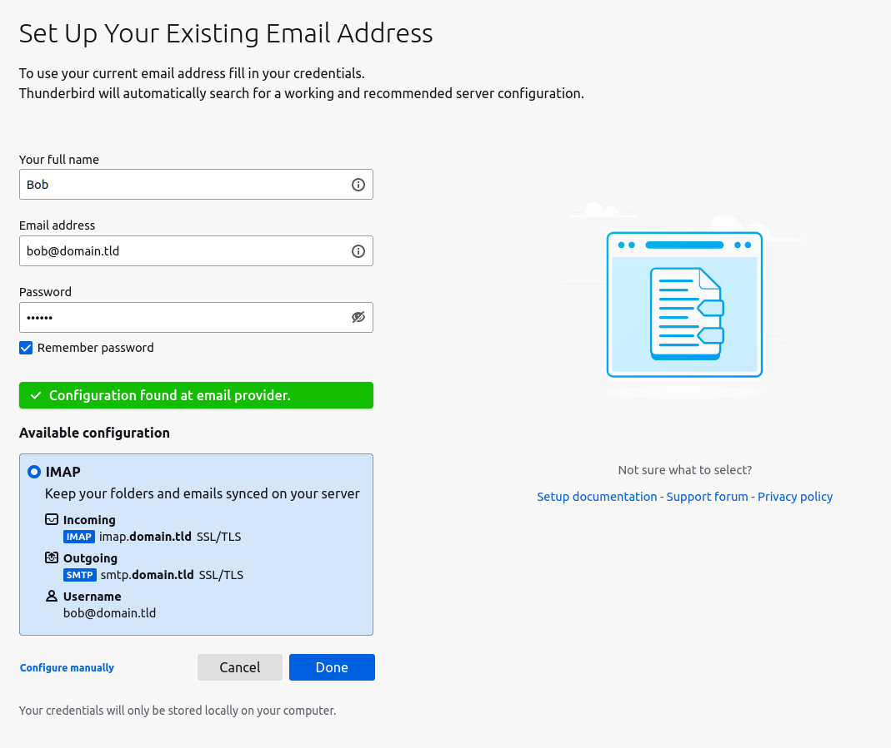
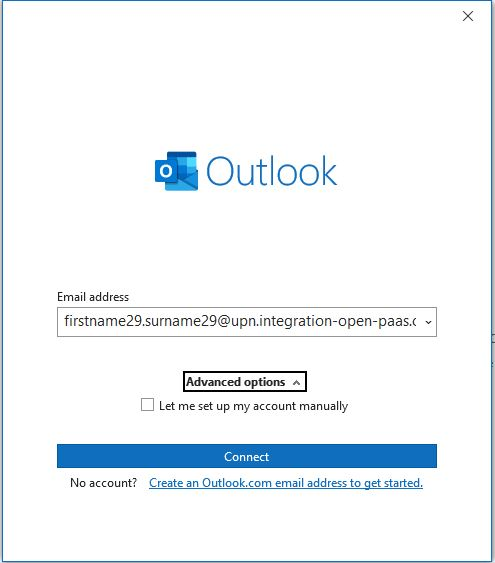
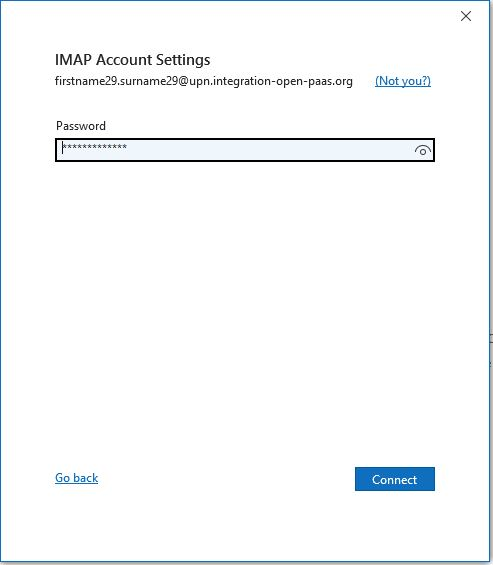
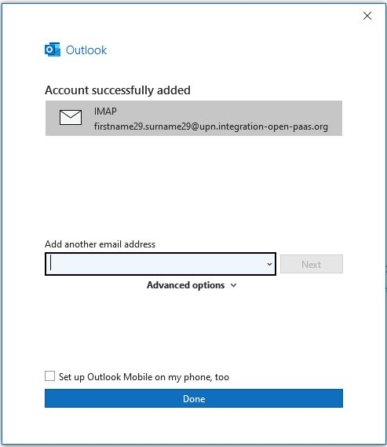

= Auto-configuration of Mail User Agents

== RFC-6186 use of SRV records

link:https://tools.ietf.org/html/rfc6186[RFC-6186] defines the usage of SRV records in order
to help users configuring their Mail User Agents in order to access your service, as it allows
to locate your services (hostnames and ports).

You would then need to publish SRV records on your DNS.

----
_imaps._tcp.domain.tld. 3600       IN    SRV    0 1 993 imap.domain.tld.
_submission._tcp.domain.tld. 3600  IN    SRV    0 1 587 smtp.domain.tld.
_jmap._tcp.domain.tld. 3600        IN    SRV    0 1 443 jmap.domain.tld.
----

== Thunderbird

Thunderbird relies on a custom XML payload being served on a subdomain.

For `user@domain.tld` an HTTP GET request would be done at `http://autoconfig.domain.tld/mail/config-v1.1.xml`

You could for instance serve the following XML payload:

[xml]
----
<clientConfig version="1.1">
  <emailProvider id="MessagingEngine">
    <domain>domain.tld</domain>
    <displayName>My company</displayName>
    <displayShortName>My company</displayShortName>
    <incomingServer type="imap">
      <hostname>imap.domain.tld</hostname>
      <port>993</port>
      <socketType>SSL</socketType>
      <authentication>password-cleartext</authentication>
      <username>%EMAILADDRESS%</username>
    </incomingServer>
    <outgoingServer type="smtp">
      <hostname>smtp.domain.tld</hostname>
      <port>465</port>
      <socketType>SSL</socketType>
      <authentication>password-cleartext</authentication>
      <username>%EMAILADDRESS%</username>
    </outgoingServer>
  </emailProvider>
</clientConfig>
----

== JMAP

link:https://datatracker.ietf.org/doc/html/rfc8620[RFC-8620] defining JMAP core RFC defines precisely service location.

James already redirects `http://jmap.domain.tld/.well-known/jmap` to the JMAP session.

You can further help your clients by publishing extra SRV records (see above).

== Example

We ship a little example hereby to ease set up.

It is comprised of a docker-compose starting a James and a side container to serve Thunderbird auto-configuration.

 - 1. Start the docker-compose

----
docker-compose up
----

 - 2. Create `domain.tld` and a user `bob@domain.tld` with a strong password (`123456`)

----
docker exec -ti james james-cli AddDomain domain.tld
docker exec -ti james james-cli Adduser bob@domain.tld 123456
----

 - 3. Register the domains `autoconfig.domain.tld`, `imap.domain.tld` and `smtp.domain.tld` in your `/etc/hosts` file.

----
127.0.0.1       domain.tld imap.domain.tld smtp.domain.tld autoconfig.domain.tld
# ...
----

 - 4. Start Thunderbird and enjoy auto-configuration!



== Outlook

In case you have your IMAP server at `imap.domain.tld` and your SMTP server at `smtp.domain.tld`, for Outlook auto-configuration to work,
you would need to set up a DNS record (e.g. CNAME or A record) for the subdomain `autodiscover.domain.tld`.

In case your IMAP/SMTP server address does not follow the above address convention, you may need to serve a `autodiscover.xml` XML file at
`autodiscover.domain.tld/autodiscover/autodiscover.xml`. Example `autodiscover.xml` file:

```xml
<Autodiscover xmlns="http://schemas.microsoft.com/exchange/autodiscover/responseschema/2006">
    <Response xmlns="http://schemas.microsoft.com/exchange/autodiscover/outlook/responseschema/2006a">
        <Account>
            <AccountType>email</AccountType>
            <Action>settings</Action>
            <Protocol>
                <Type>IMAP</Type>
                <Server>imap.server.domain.tld</Server>
                <Port>993</Port>
                <DomainRequired>off</DomainRequired>
                <LoginName/>
                <SPA>off</SPA>
                <SSL>on</SSL>
                <AuthRequired>on</AuthRequired>
            </Protocol>
            <Protocol>
                <Type>SMTP</Type>
                <Server>smtp.server.domain.tld</Server>
                <Port>465</Port>
                <DomainRequired>off</DomainRequired>
                <LoginName/>
                <SPA>off</SPA>
                <Encryption>SSL</Encryption>
                <AuthRequired>on</AuthRequired>
                <UsePOPAuth>off</UsePOPAuth>
                <SMTPLast>off</SMTPLast>
            </Protocol>
        </Account>
    </Response>
</Autodiscover>
```

Please note that Outlook asks a Microsoft remote service for auto configuration discovery, therefore you should not be
able to set up an local IMAP server to test the Outlook configuration.

=== Demo Outlook auto configuration

- 1. Enter your email address:



- 2. Enter your password:



- 3. Enjoy Outlook auto configuration!

