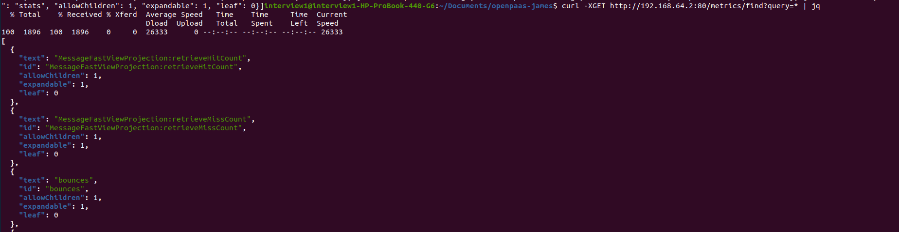

# Custom metric integration

James comes with built in integration with the [Prometheus](https://prometheus.io/) ecosystem, and
a plugin to [export metrics directly to ElasticSearch]() exist.

However, one might be willing to integrate with arbitrary metric system.

This project demonstrate how to leverage [dropwizard metrics](https://metrics.dropwizard.io/4.2.0/)
 [built in extensions](https://metrics.dropwizard.io/4.2.0/manual/graphite.html)
to connect Apache James with [Graphite](https://graphiteapp.org/).

# Running the example

For this we build a GraphiteExporter implementing the `UserDefinedStartable` interface.

Build the project:

```
mvn clean install
```

Drop the jar with dependencies in the James `extensions-jars` folder.

Register it in James configuration, in `extensions.properties`:

```
guice.extension.startable=org.apache.james.examples.GraphiteExporter
```

Then start James.

Metrics can be retrieved in Graphite:

```
curl -XGET http://192.168.64.2:80/metrics/find?query=* | jq
```



# Running the example with docker compose

Compile:

```
mvn clean install
```

Then start James:

```
docker-compose up
```
