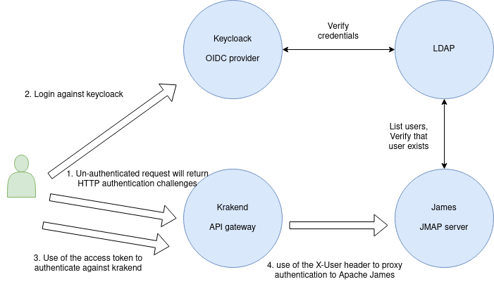
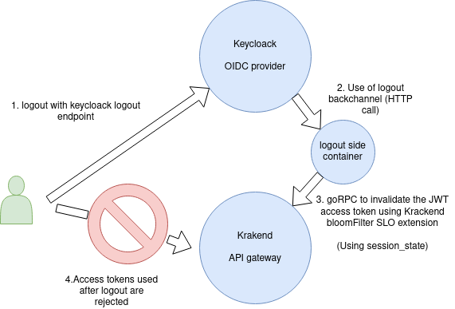
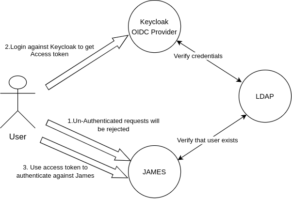
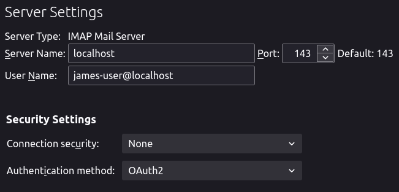
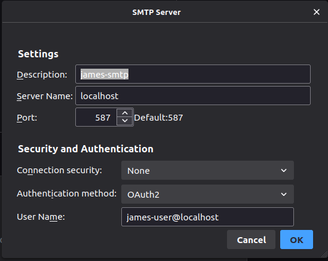
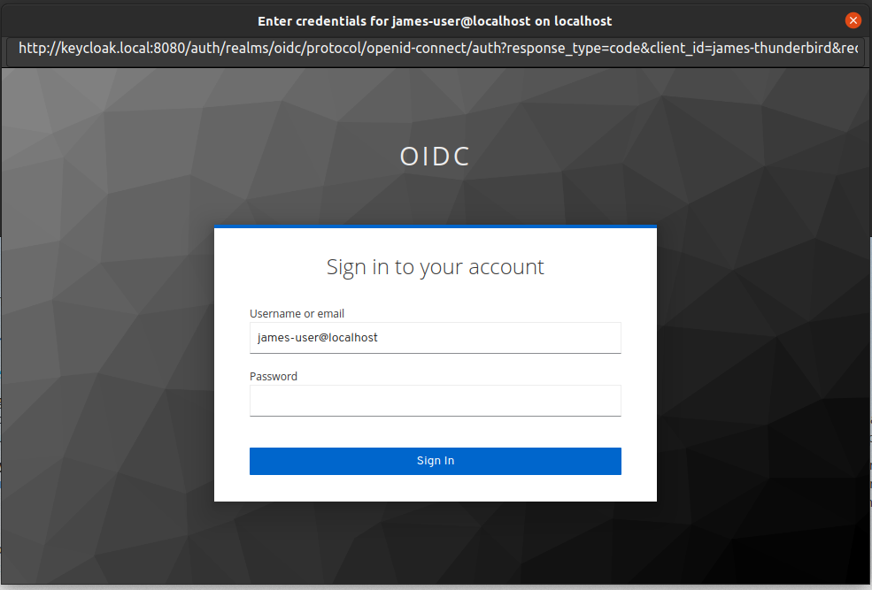
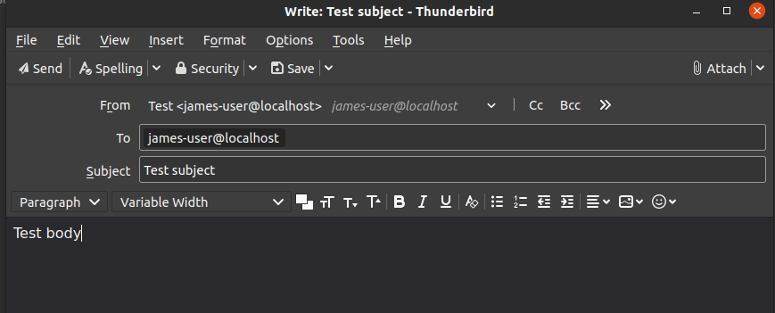
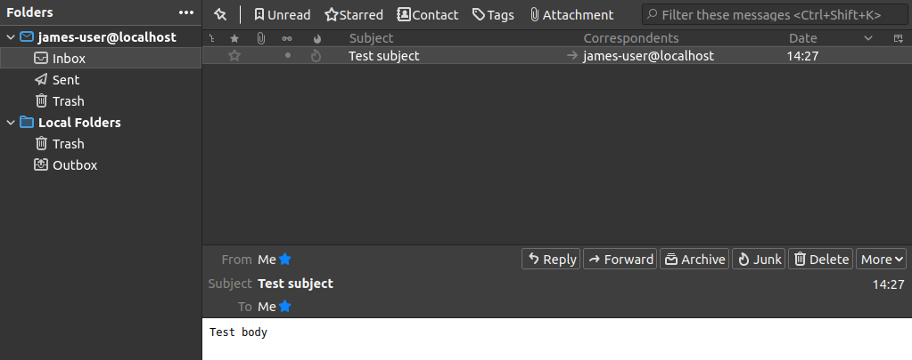

OIDC JMAP, IMAP and SMTP example with James
====

This is just a small example of an OIDC setup with James and JMAP HTTP, IMAP and SMTP. 

This docker-compose will start the following services:

* LDAP with a pre-provisioned user `james-user@localhost` and his password `secret`
* Keycloak with a pre-configured `oidc` realm, `oidc` client (dedicated for JMAP), `james-thunderbird` client (dedicated for IMAP/SMTP) and connected to the LDAP for its user base
* James memory version using the LDAP and:
  * `XUserAuthenticationStrategy` for JMAP
  * `XOAUTH2` for IMAP/SMTP
* KrakenD being the OIDC gateway against James by exposing two endpoints: 
  * `POST /jmap` for JMAP requests against James with normal authentication
  * `POST /oidc/jmap` for JMAP request against James with a JWT token issued by the Keycloak
* a jwt-revoker side container that will be called by Keycloak back-channel logout to invalidate tokens (SLO)
  
## Overall architecture

### JMAP

Here is an architecture diagram showing how Single Sign On works for this example:



SSO auto-discovery might require the set up of a `.well-known/webfinger` endpoint described in 
[this spec](https://openid.net/specs/openid-connect-discovery-1_0.html)
via external means (not provided here).

Here is an architecture diagram showing how Single Log Out works for this example, using the backchannel OIDC flow:



### IMAP/SMTP
Here is an architecture diagram showing how to authenticate JAMES IMAP/SMTP using OIDC Provider:



## Start the service

Just do:

```bash
docker-compose up
```

## Try it out

### SSO

There is no frontend in this example to interact directly with Keycloak and get a valid JWT token from it. 

However, you can use the Keycloak playground example:

* Open your browser and go to https://www.keycloak.org/app/
* Fill the form with your local Keycloak info and click `Save`:
  * Keycloak URL: `http://localhost:8080/auth`
  * Realm: `oidc`
  * Client: `oidc`
* Click `Sign in` and you will get redirected to your Keycloak login screen
* Open the Developer Tools of your browser and check the network connections
* Enter the credentials of the user: `james-user@localhost / secret`
* Get the response of the token request and save the `access_token` sent back from Keycloak
* Do a JMAP request (like a `Mailbox/get`) with curl, Postman, ... towards the `/oidc/jmap` endpoint of Krakend:
  * URL: `POST http://localhost:8090/oidc/jmap`
  * AccountId of the user (for the JMAP request body): `fe100f0103112aa50a585b7ca037c6b9387352991fc35cec15faf7ce4edd8d03`
  * Put the JWT token you got from Keycloak in the `Authorization` header as a Bearer token
  * Don't forget the `Accept` header as well with the value `application/json; jmapVersion=rfc-8621` to use the JMAP spec from the RFC-8621

If everything goes well, you should get a valid response back.

### SLO

When user is logging out, we use Keycloak back-channel logout to send a message to the jwt-revoker side container 
that will parse the `logout_token`, fetch the `sid` claim (id of the session the user decided to terminate) and add it
to the bloomfilter of Krakend. Then Krakend will reject tokens having the same `sid`, because that session has been revoked.

You can try it out with our example by :

* Repeat the SSO steps and get the token
* Call the JMAP endpoint with that token to check it's valid
* Click on the `Logout` button in the Keycloak app
* Try to call the JMAP endpoint again, and you get a 401 response from Krakend as it's been revoked

### IMAP/SMTP authentication

We would use Thunderbird version 91.4.1 as a mail client (above versions should work).
* Open `/thunderbird/omni.ja` in your host, find and modify `OAuth2Providers.jsm`:
  * Add James hostname in kHostnames: `["localhost", ["james.local", "email"]],`
  * Register using `james-thunderbird` Keycloak client in kIssuers:
  ```
  [
    "james.local",
    [
      "james-thunderbird", //client_id from keycloak
      "Xw9ht1veTu0Tk5sMMy03PdzY3AiFvssw", // client_secret from keycloak
      "http://keycloak.local:8080/auth/realms/oidc/protocol/openid-connect/auth",
      "http://keycloak.local:8080/auth/realms/oidc/protocol/openid-connect/token",
    ],
  ] 
  ```
  
* Adding a line `127.0.0.1 keycloak.local` to your `/etc/hosts` so Thunderbird can resolve the address of keycloak.
* Run Thunderbird, configure it using `james-user@localhost` account against these IMAP/SMTP settings:
  * IMAP: server: localhost, port: 143, connection security: No, authentication method: OAUTH2
    
  * SMTP: server: localhost, port: 587, connection security: No, authentication method: OAUTH2
    
* Click `Get Messsages` in your INBOX tab, a popup will show up ask you to login against Keycloak.
  
After logging in succeed, you can use James IMAP/SMTP. Let try to send a mail to yourself:
  
  Then it should work:
  

A remark here is that if you generate a new client_secret for `james-thunderbird` client in Keycloak, you have to modify
it accordingly in `OAuth2Providers.jsm`.