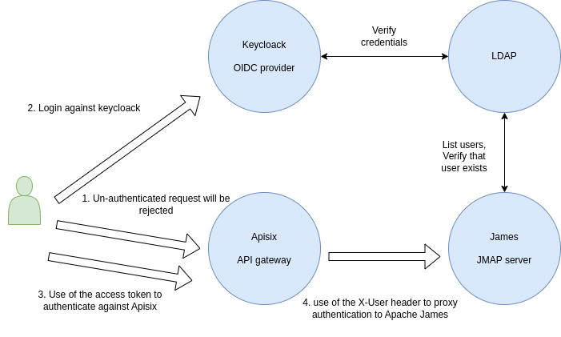
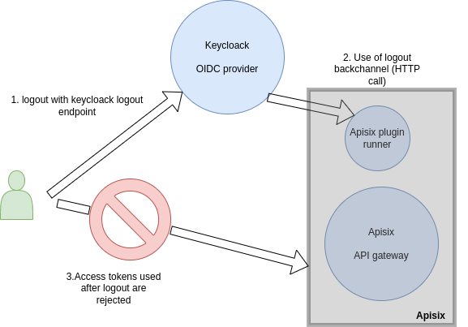
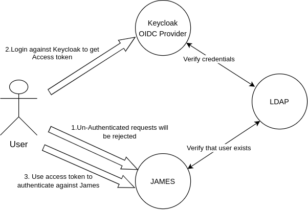
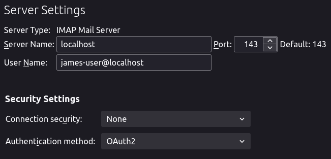
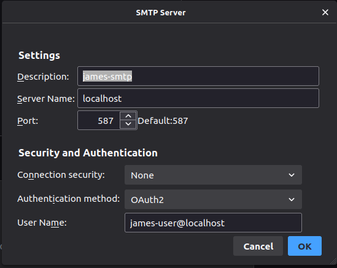
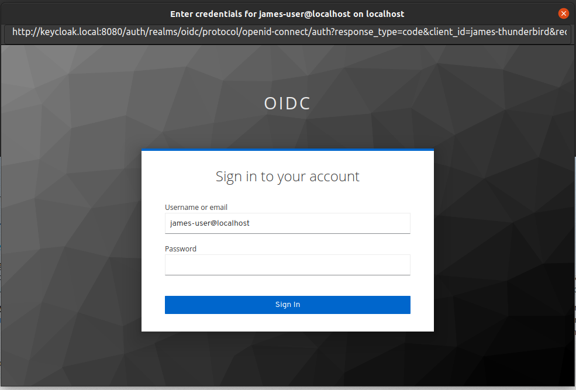
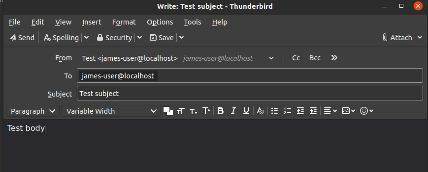
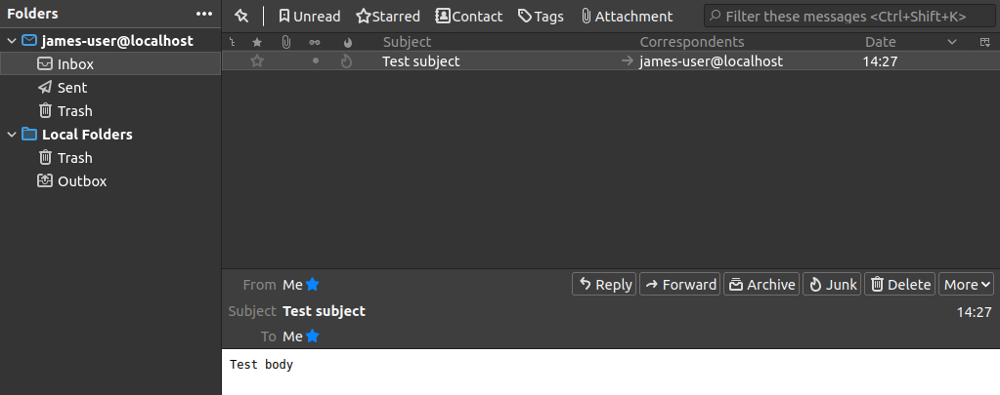

# OIDC JMAP, IMAP and SMTP example with James, Apisix API Gateway, Keycloak, LDAP

====

This is example of an OIDC setup with James.

The API Gateway for example is [Apisix](https://apisix.apache.org/), we can use Apisix for websocket gateway, horizontal scaling, etc...

This [docker-compose](docker-compose.yml) will start the following services:

- apisix: The image `linagora/apisix:3.2.0-debian-javaplugin` was created by Linagora. It based on `apisix:3.2.0-debian`, it already contain apisix plugin for 
  SLO (Single Logout) and rewrite the `X-User` header. 
  - Dockerfile: [here](https://github.com/linagora/tmail-backend/blob/master/demo/apisix/Dockerfile)
  - Project `tmail-apisix-plugin-runner`: [here](https://github.com/linagora/tmail-backend/tree/master/demo/apisix/tmail-apisix-plugin-runner)
  - Apisix being the OIDC gateway against James by exposing two endpoints:
      - `POST /jmap` for JMAP requests against James with normal authentication
      - `POST /oidc/jmap` for JMAP request against James with a JWT token issued by the LemonLDAP
- james: Memory version using the LDAP and `XUserAuthenticationStrategy` for JMAP
- sso.example.com: keycloak image with a pre-configured `oidc` realm, `oidc` client (Authorization Code Flow, should dedicate for JMAP), `james-thunderbird` client (Client Credentials Flow, dedicated for IMAP/SMTP) and connected to the LDAP for its user base
- ldap: with a pre-provisioned user `james-user@tmail.com` and his password `secret`
- redis: for storage of the revoked token. This is optional, we can un-use it if we want to store it in-memory with Apisix standalone.

## Overall architecture

### JMAP

Here is an architecture diagram showing how Single Sign On works for this example:



SSO auto-discovery might require the set up of a `.well-known/webfinger` endpoint described in
[this spec](https://openid.net/specs/openid-connect-discovery-1_0.html)
via external means (not provided here).

Here is an architecture diagram showing how Single Log Out works for this example, using the backchannel OIDC flow:



### IMAP/SMTP
Here is an architecture diagram showing how to authenticate JAMES IMAP/SMTP using OIDC Provider:




## How to run it

```bash
docker-compose up -d
```

## Try it out 

Before test it, we need to modify the `/etc/hosts` first.

```bash
127.0.0.1 sso.example.com apisix.example.com
```

### JMAP

There is no frontend in this example to interact directly with Keycloak and get a valid JWT token from it.

However, you can use the Keycloak playground example with the following steps (based on Authorization Code Flow): 

* Open your browser and go to https://www.keycloak.org/app/
* Fill the form with your local Keycloak info and click `Save`:
  * Keycloak URL: `http://sso.example.com:8080/auth`
  * Realm: `oidc`
  * Client: `oidc`
* Click `Sign in` and you will get redirected to your Keycloak login screen
* Open the Developer Tools of your browser and check the network connections
* Enter the credentials of the user: `james-user@localhost / secret`
* Get the response of the token request and save the `access_token` sent back from Keycloak
* Do a JMAP request (like a `Mailbox/get`) with curl, Postman, ... towards the `/oidc/jmap` endpoint of Apisix:
  * URL: `POST http://apisix.example.com:9080/oidc/jmap`
  * AccountId of the user (for the JMAP request body): `fe100f0103112aa50a585b7ca037c6b9387352991fc35cec15faf7ce4edd8d03`
  * Put the JWT token you got from Keycloak in the `Authorization` header as a Bearer token
  * Don't forget the `Accept` header as well with the value `application/json; jmapVersion=rfc-8621` to use the JMAP spec from the RFC-8621

If everything goes well, you should get a valid response back.

We can discover the oauth2 by endpoint `http://sso.example.com:8080/auth/realms/oidc/.well-known/openid-configuration`

If you want to test SSO, SLO with `curl`, you can use the bellow command:

#### Get the Access token

Based on Client Credentials Flow

```bash
GET_TOKEN_RESPONSE=`curl --location 'http://sso.example.com:8080/auth/realms/oidc/protocol/openid-connect/token' \
                                  --header 'Content-Type: application/x-www-form-urlencoded' \
                                  --data-urlencode 'grant_type=password' \
                                  --data-urlencode 'scope=openid profile email' \
                                  --data-urlencode 'client_id=james-thunderbird' \
                                  --data-urlencode 'client_secret=Xw9ht1veTu0Tk5sMMy03PdzY3AiFvssw' \
                                  --data-urlencode 'username=james-user@localhost' \
                                  --data-urlencode 'password=secret' 2>/dev/null`

ACCESS_TOKEN=`echo $GET_TOKEN_RESPONSE 2>/dev/null |perl -pe 's/^.*"access_token"\s*:\s*"(.*?)".*$/$1/'`
REFRESH_TOKEN=`echo $GET_TOKEN_RESPONSE 2>/dev/null |perl -pe 's/^.*"refresh_token"\s*:\s*"(.*?)".*$/$1/'`
```

#### Use the Access Token to access James JMAP server via Apisix API Gateway

```bash
curl 'http://apisix.example.com:9080/oidc/jmap/session' \
--header 'Accept: application/json; jmapVersion=rfc-8621' \
--header 'Authorization: Bearer '$ACCESS_TOKEN 
```
The response example:
```
HTTP/1.1 200 OK

{
    "capabilities": {...}
    "username": "james-user@tmail.com",
    "state": "2c9f1b12-b35a-43e6-9af2-0106fb53a943"
}
```

#### Single Logout

Logout from Keycloak

```bash
curl --location 'http://sso.example.com:8080/auth/realms/oidc/protocol/openid-connect/logout' \
--header 'Content-Type: application/x-www-form-urlencoded' \
--data-urlencode 'client_id=james-thunderbird' \
--data-urlencode 'client_secret=Xw9ht1veTu0Tk5sMMy03PdzY3AiFvssw' \
--data-urlencode 'refresh_token='$REFRESH_TOKEN
```

Verify the revoked access token can't access the JMAP server anymore.
```bash
curl 'http://apisix.example.com:9080/oidc/jmap/session' \
--header 'Accept: application/json; jmapVersion=rfc-8621' \
--header 'Authorization: Bearer '$ACCESS_TOKEN 
```

The response example:
```
HTTP/1.1 401 Unauthorized

<html>
<head><title>401 Authorization Required</title></head>
<body>
<center><h1>401 Authorization Required</h1></center>
<hr><center>openresty</center>
<p><em>Powered by <a href="https://apisix.apache.org/">APISIX</a>.</em></p></body>
</html>
```

#### Websocket 

Use websocket with endpoint `ws://apisix.example.com:9080/oidc/jmap/ws` and the same access token.


### IMAP/SMTP authentication


We would use Thunderbird version 91.4.1 as a mail client (above versions should work).
* Open `/thunderbird/omni.ja` in your host, find and modify `OAuth2Providers.jsm`:
  * Add James hostname in kHostnames: `["localhost", ["james.local", "email"]],`
  * Register using `james-thunderbird` Keycloak client in kIssuers:
  ```
  [
    "james.local",
    [
      "james-thunderbird", //client_id from keycloak
      "Xw9ht1veTu0Tk5sMMy03PdzY3AiFvssw", // client_secret from keycloak
      "http://keycloak.local:8080/auth/realms/oidc/protocol/openid-connect/auth",
      "http://keycloak.local:8080/auth/realms/oidc/protocol/openid-connect/token",
    ],
  ] 
  ```

* Adding a line `127.0.0.1 keycloak.local` to your `/etc/hosts` so Thunderbird can resolve the address of keycloak.
* Run Thunderbird, configure it using `james-user@localhost` account against these IMAP/SMTP settings:
  * IMAP: server: localhost, port: 143, connection security: No, authentication method: OAUTH2
    
  * SMTP: server: localhost, port: 587, connection security: No, authentication method: OAUTH2
    
* Click `Get Messsages` in your INBOX tab, a popup will show up ask you to login against Keycloak.
  
  After logging in succeed, you can use James IMAP/SMTP. Let try to send a mail to yourself:
  
  Then it should work:
  

A remark here is that if you generate a new client_secret for `james-thunderbird` client in Keycloak, you have to modify
it accordingly in `OAuth2Providers.jsm`.