# OpenSearch dashboard for Apache James

[OpenSearch dashboard](https://opensearch.org/docs/latest/dashboards/) is a solution allowing data visualization on top of an existing OpenSearch cluster.

It can be used to create interesting visualizations when used on top of Apache James OpenSearch indexes.

## Set up

1. Adapt the `docker-compose.yml` file to your needs (IP address & credentials)
2. Start it with `docker compose up`
3. Login in your browser: `http://127.0.0.1:5601` with the credential documented in the `docker-compose.yml` file
4. In `Dashboard Management > Index pattern` import the `mailbox_v2` (using date as a date field) and `quota_ratio_v1` 
5. In `Dashboard Management > Saved objects` import `james-dashboard.ndjson`

## Supported visualizations

 - Quota usage

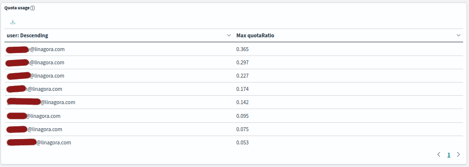

 - New mails timeline

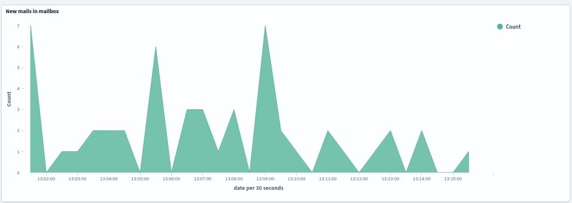

 - Top senders

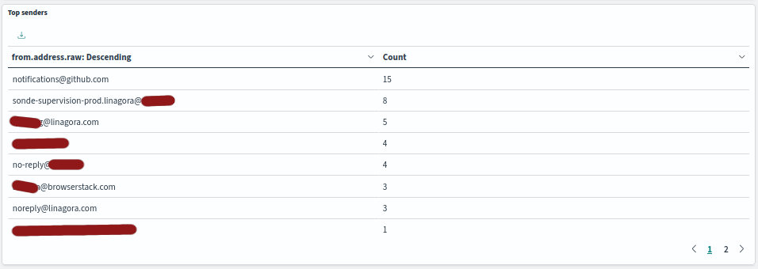

 - Top recipients


 - Email size distribution

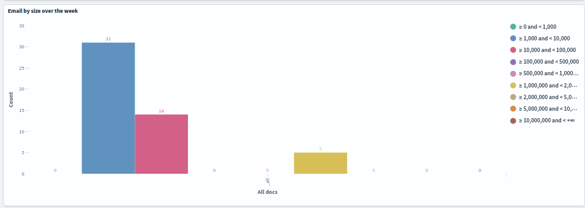

 - Attachment usage report

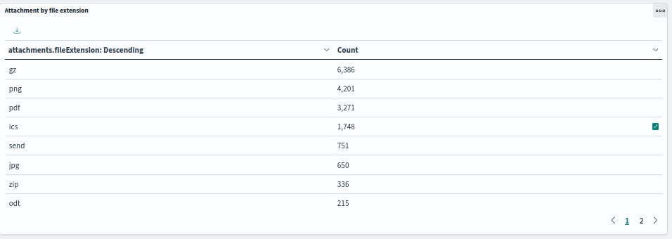

 - Total email created during the period

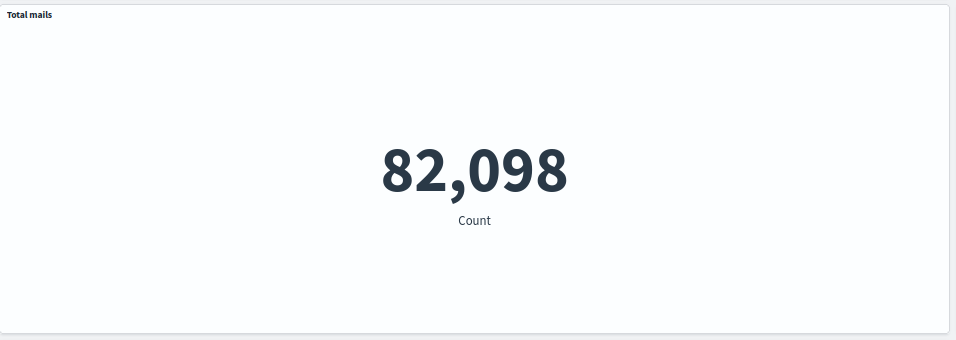

 - Unique email (by message-id)

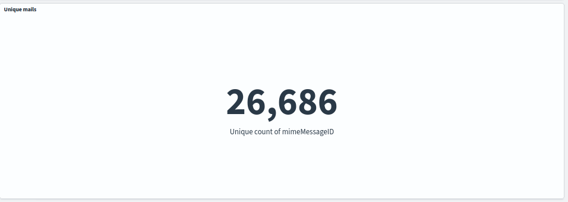

 - Read / unread ratio

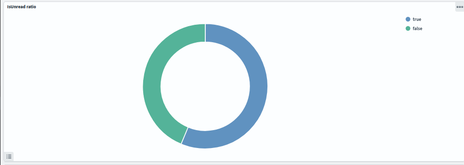

 - has attachment ratio

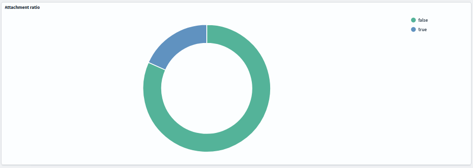

 - user flag heatmap

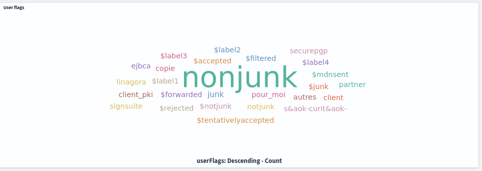

 - People that reads the more mails

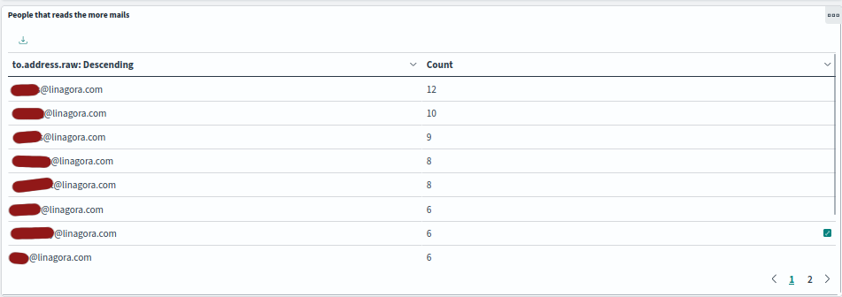

 - People that answers the more mails

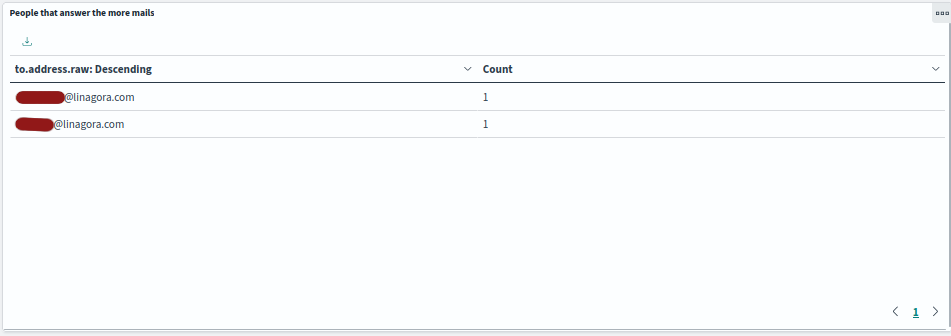

 - People that generates the most data (by size)

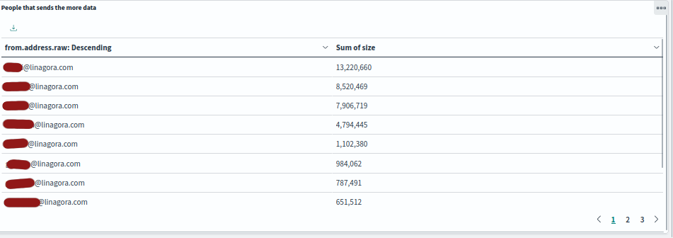

 - Recipient count analysis

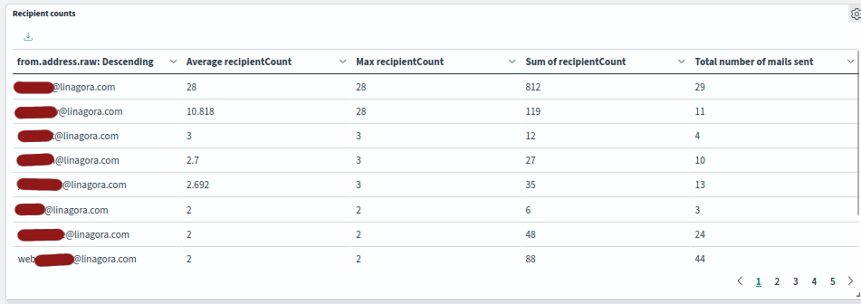

 - Estimated delivery times in second (differences between sentDate and savedDate)

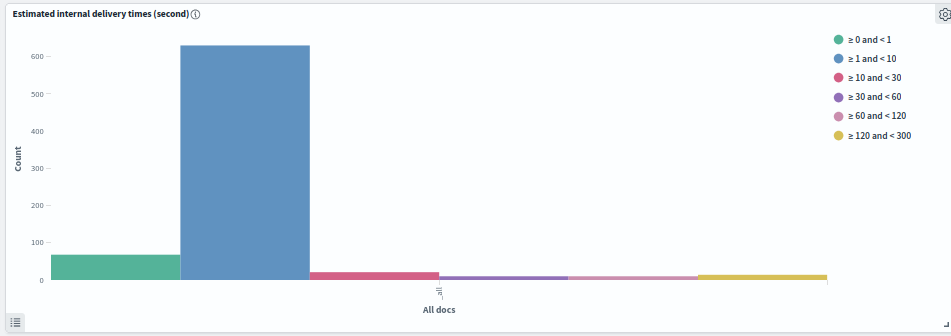

## Scripted fields

Some of the above visualizations relies on scripted fields.

In order to create them navigate the following menus:

> Dashboard management
> Index pattern
> mailbox_v2
> scripted field

Then create the following scripted fields:

```
language: painless
type: number
format: numer
name: recipientCount
Script:

int count = 0;

    for (nested in params._source.to) {
        count += 1;
    }   

return count;
```

and 

```
> Dashboard management
> Index pattern
> mailbox_v2
> scripted field

language: painless
type: number
format: numer
name: deliveryTime
Script:

if (doc.containsKey('saveDate') && doc.containsKey('sentDate')) {
    return (doc['saveDate'].value.getMillis() - doc['sentDate'].value.getMillis()) / 1000;  
} else {
    return 0;
}
```