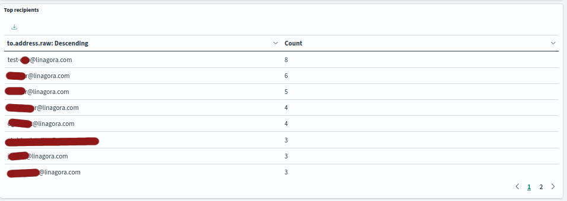

# OpenSearch dashboard for Apache James

[OpenSearch dashboard](https://opensearch.org/docs/latest/dashboards/) is a solution allowing data visualization on top of an existing OpenSearch cluster.

It can be used to create interesting visualizations when used on top of Apache James OpenSearch indexes.

## Set up

1. Adapt the `docker-compose.yml` file to your needs (IP address & credentials)
2. Start it with `docker compose up`
3. Login in your browser: `http://127.0.0.1:5601` with the credential documented in the `docker-compose.yml` file
4. In `Dashboard Management > Index pattern` import the `mailbox_v2` (using date as a date field) and `quota_ratio_v1` 
5. In `Dashboard Management > Saved objects` import `james-dashboard.ndjson`

## Supported visualizations

 - Quota usage

 - New mails timeline

 - Top senders

 - Top recipients

 - Email size distribution

 - Attachment usage report

 - Total email created during the period

 - Unique email (by message-id)

 - Read / unread ratio

 - has attachment ratio

 - user flag heatmap

