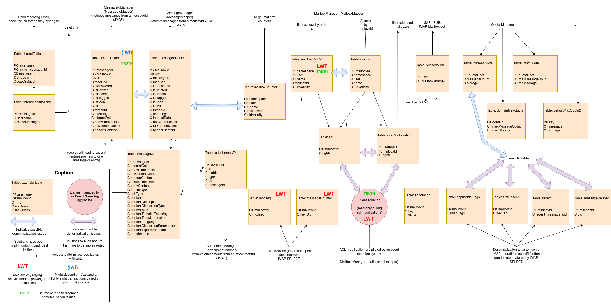

# Cassandra implementation for the mailbox

This file attempts to provide information useful to mailbox/cassandra developers.

## Table structure

Can be edited using [this source file](table_structure.drawio) on [this website](https://app.diagrams.net/).

This file should be edited everytime the table structure is modified.

## Approach regarding denormalization

The Cassandra mailbox is heavily relies on denormalization. The same data is stored several time, in distinct tables,
to satisfy the various read access patterns. Of course, the various table can become inconsistent between them.

We have been developing several approaches in order to diagnose, mitigate and solve such issues. They are described in
the following documents:

 - [Applicative read repaires](../../../src/adr/0042-applicative-read-repairs.md)
 - [Inconsistencies among messages](../../../src/adr/0022-cassandra-message-inconsistency.md)
 - [Inconsistencies among mailboxes](../../../src/adr/0020-cassandra-mailbox-object-consistency.md)
 - [Recompute user quotas](../../../src/adr/0028-Recompute-mailbox-quotas.md)
 - [Mailbox counter inconsistencies](../../../src/adr/0023-cassandra-mailbox-counters-inconsistencies.md)