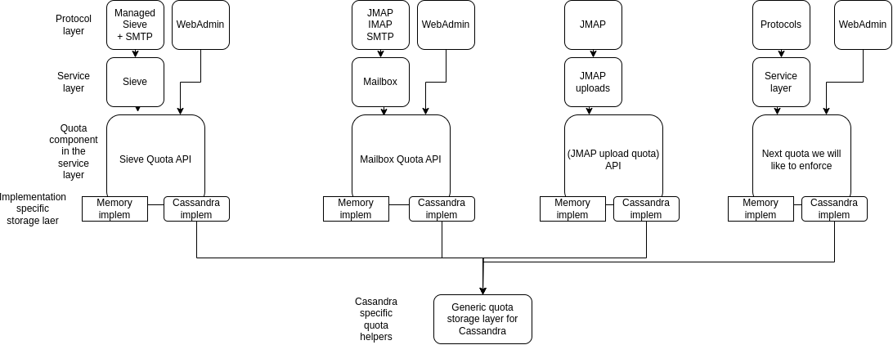

# 68. Mutualize Cassandra storage for Quota

Date: 2023-08-18

## Status

Accepted (lazy consensus).

Not implemented yet.

## Context

One generic threat is resource abuse. Meaning a user uses an unfair amount of resources.

Similarily resource limitation is a way to decrease operating costs.

Quota, standardized in IMAP via [RFC-9208](https://www.rfc-editor.org/rfc/rfc9208.html) and in JMAP via
[RFC-9425](https://datatracker.ietf.org/doc/rfc9425/) are a mechanism designed to keep track of
user current usage of the resource and match it against the stored limit.

Resource limitation is a broad use case that we might want t better enforce in Apache James. This is especially
important when operating in SaaS mode, and actual users might be badly intentionned. See
[ADR-67 Quota for JMAP uploads](0067-quota-for-jmap-uploads.md).

As such, there is duplication, especially at the storage layers. Similar features might benefit from mutualized storage.

Especially, it is worth mentionning that Cassandra tables do not come for free: we have a strong incentive to reduce their count.
See [The Last Pickle blog post on this topic](https://thelastpickle.com/blog/2020/11/25/impacts-of-many-tables-on-cassandra.html).

In particular (quote from the above article):

```
If some tables share the same columns, it could be interesting to merge them into a single one, 
adding a column to the partition key to distinguish data belonging to different tables.
```

## Decision

Add Cassandra storage helpers, exposing a generic interface for Cassandra quota implementation of various services to mutualize their
storage. This relies on a part of the primary key allowing to distinguish the component.



The helper will consist of 2 tables:
- One composed of counters to track current value
- One comosed of regular `long` to track limits

(one can not mix counters and regular values in the same table in Cassandra).

Port exising Cassandra implementations of quota for various services to use those helpers. Namely the Cassandra mailbox, Sieve storage. Use those
helpers to implement JMAP quota uploads.

## Consequences

We expect a small decrease of the count of tables in our Cassandra schema, going from 7 (one for mailbox quota current value, one for mailbox quota
per user limit, one for mailbox quota per domain limit, one for mailbox quota global limit, one for Sieve uota current value, one for Sieve quota
per user limit, one for Sieve Quota global limit, one for JMAP uploads current value) to just 2 (helper tables: one for current value, one for limits).

We expect to make it easier to implement quta related features in the future.

We need to set up Cassandra migration tasks and to record the schema upgrade into the upgrade instructions. A compaibility mode will need to be
explicitly cnfigured in order to run the migration.

## Alternatives

Keep the current, exploded table structure and either do not care about table count increase or do not implement further impotant resource limitation
use cases.

## References

- [JIRA](https://issues.apache.org/jira/projects/JAMES/issues/JAMES-3926)
- [PR of the ADR](https://github.com/apache/james-project/pull/1692)
- [The last pickle article: impacts of many tables in a Cassandra daa model](https://thelastpickle.com/blog/2020/11/25/impacts-of-many-tables-on-cassandra.html)
- [RFC-9208 IMAP quotas](https://www.rfc-editor.org/rfc/rfc9208.html)
- [RFC-9425 JMAP quotas](https://datatracker.ietf.org/doc/rfc9425/)
- [ADR-67 Quota for JMAP uploads](0067-quota-for-jmap-uploads.md)