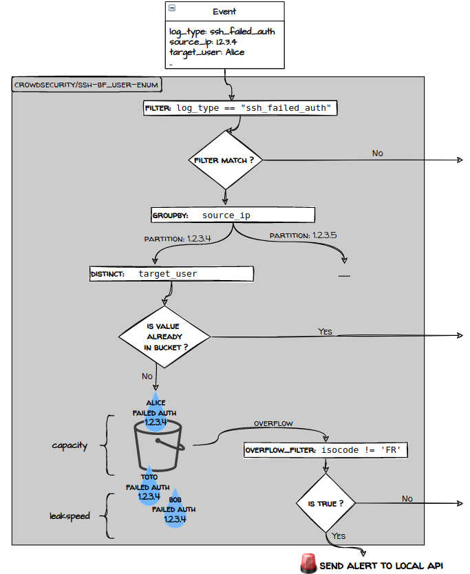

# 69. Crowdsec

Date: 2022-10-26

## Status

Accepted (lazy consensus).

Implemented. 

## Context

Currently, there is no mechanism to check harmful IP addresses implementing attacks like bruteforce attacks, dictionary attacks, etc.

- Bruteforce attack: A hacker attempts to guess the user's login credentials.
- Dictionary attacks: A dictionary attack tries to find out the list of valid mail addresses.

## Decision 

To that end, we will integrate James with [Crowdsec](https://www.crowdsec.net/). Crowdsec will check James logs, based on defined scenarios, Crowdsec can detect malevolent behaviors, and block them from accessing James at various levels (infrastructure - firewall, system, applicative). To ease end user configuration, and propose a bundled experience independent from end user infrastructure, we implement Crowdsec remediations at application level. Willing users can very well set up remediations based on their underlying infrastructure.

A quick introduction about Crowdsec:

```
CrowdSec Security Engine is an open-source and lightweight software that allows you to detect peers with malevolent behaviors and block them from accessing your systems at various levels (infrastructural, system, applicative).

To achieve this, the Security Engine reads logs from different sources (files, streams ...) to parse, normalize and enrich them before matching them to threats patterns called scenarios. 
```

CrowdSec ships by default with scenarios (brute force, port scan, web scan, etc.) adapted for most contexts, but we can easily extend it by picking more of them from the [HUB](https://app.crowdsec.net/hub/collections). It is also easy to adapt an existing one or create one ourselves.

Set up a new maven project dedicated to Crowdsec extension. This allows to be embedded in a James server as a soft dependency
using the external-jar loading mechanism. With this way, the extension could be dropped in one's James installation, and not a runtime dependency.

### How does Crowdsec apply?
- Many attacks on James via IMAP, SMTP, JMAP can be detected by Crowdsec
- Crowdsec analyzes logs from James, then based on their patterns in parsers, it can detect each behavior in James. 
- Scenarios are YAML files that allow to detect a specific behavior, usually an attack. With James, we detect bruteforce login attack and Dictionary attack.
- Each line log is an event in Crowdsec. If an event triggers the condition in Crowdsec, Crowdsec will send an alert to the Local API, and make a decision (ban)
- James connects to Crowdsec via https protocol with reactor http client to query the decision from Crowdsec

## Consequences

- James will be more secure by blocking threats at various levels (applicative, system, infrastructural).
- We can document and share Crowdsec scenario thus allowing users to benefit from each other decisions. Also we can get dangerous IP detected by community via using Central API
- Crowdsec natively supports distributed deployments (reference: ) by setting up an agent per node gathering logs of local containers and forwarding them to the crowdsec API that decides if remediations should be applied. 
- This architecture is not horizontally scalable in itself but should already be able to analyse over 1000 relevant logs per seconds (metric obtained by discussing with Crowdsec team), which should allow leveraging very large scale James deployments.

## Alternatives

- Fail2ban can detect these attacks, however it is complex to setup in a distributed system and very related to the underlying architecture thus hard to document within the community.
- Fail2ban do not permit sharing with peers the underlying blocked data.

## References

- [JIRA](https://issues.apache.org/jira/browse/JAMES-3897)
- [Crowdsec](https://www.crowdsec.net/)