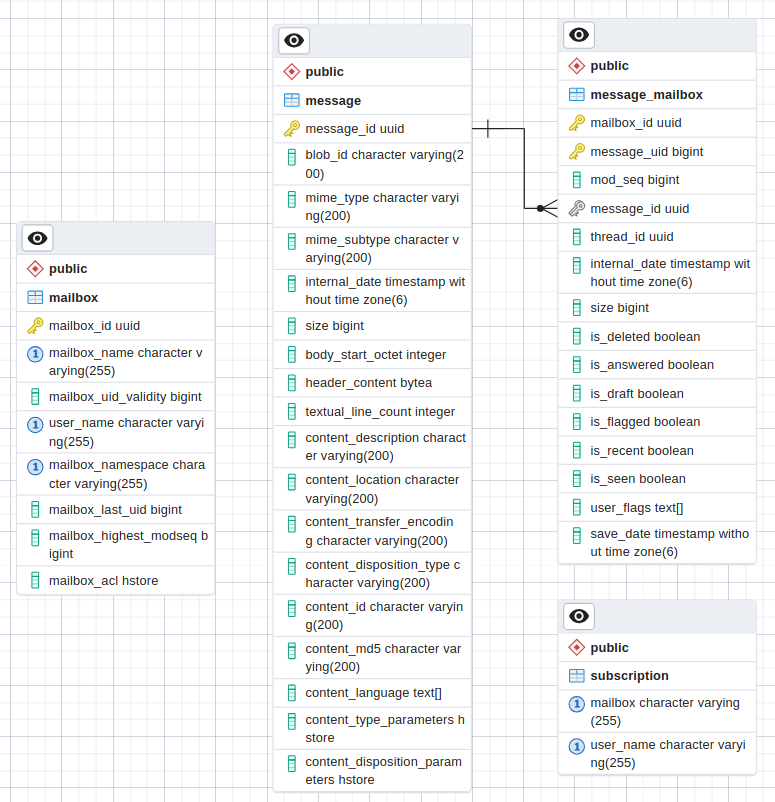

# 71.  Postgresql Mailbox tables structure

Date: 2023-12-14

## Status

Implemented

## Context

Apache James was integrated with Postgresql database. The table structure for mailbox was created to store mailbox data in Postgresql database.

## Decision

Indexes in table message_mailbox: 
- message_mailbox_message_id_index (message_id)
- mailbox_id_mail_uid_index (mailbox_id, message_uid)
- mailbox_id_is_seen_mail_uid_index (mailbox_id, is_seen, message_uid)
- mailbox_id_is_recent_mail_uid_index (mailbox_id, is_recent, message_uid)
- mailbox_id_is_delete_mail_uid_index (mailbox_id, is_deleted, message_uid)

Indexes are used to find records faster

For some fields, hstore data type are used. Hstore is key-value hashmap data structure. It is useful in some cases. For example, the database needs to store a list of usernames and corresponding rights for a mailbox. By applying hstore, acl that belongs to a specific mailbox and username could be retrieved quickly.

## Consequences

Pros:
- Indexes could increase query speed significantly

Cons:
- Too many indexes in a table could reduce the speed of updating data in the table

## Alternatives

## References

- [JIRA](https://issues.apache.org/jira/browse/JAMES-2586)
- [PostgreSQL](https://www.postgresql.org/)

