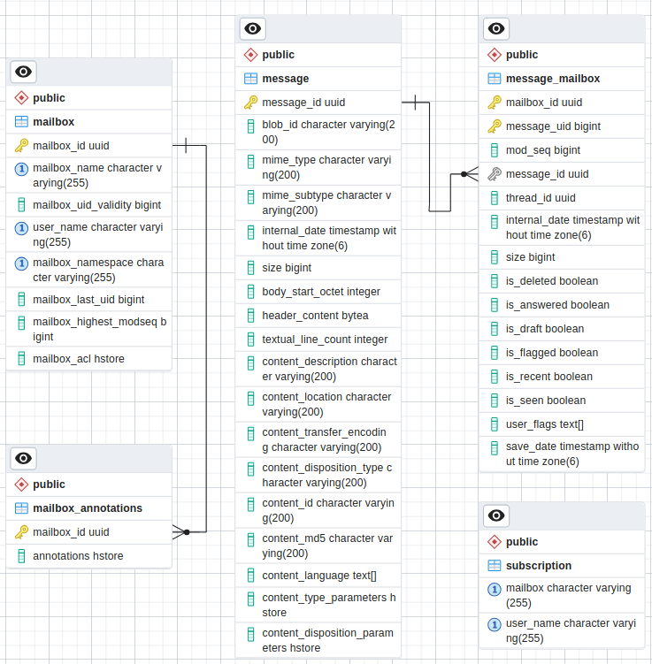

# 71.  Postgresql Mailbox tables structure

Date: 2023-12-14

## Status

Implemented

## Context

As described in [ADR-70](link), we are willing to provide a Postgres implementation for Apache James.
The current document is willing to detail the inner working of the mailbox of the target implementation.

## Decision

Table list:
- mailbox
- mailbox_annotations
- message
- message_mailbox
- subscription

Indexes in table message_mailbox: 
- message_mailbox_message_id_index (message_id)
- mailbox_id_mail_uid_index (mailbox_id, message_uid)
- mailbox_id_is_seen_mail_uid_index (mailbox_id, is_seen, message_uid)
- mailbox_id_is_recent_mail_uid_index (mailbox_id, is_recent, message_uid)
- mailbox_id_is_delete_mail_uid_index (mailbox_id, is_deleted, message_uid)

Indexes are used to find records faster.

The table structure is mostly normalized which mitigates storage costs and achieves consistency easily.

Foreign key constraints (mailbox_id in mailbox_annotations, message_id in message_mailbox) help to ensure data consistency. For example, message_id 1 in table message_mailbox could not exist if message_id 1 in table message does not exist  

For some fields, hstore data type are used. Hstore is key-value hashmap data structure. Hstore allows us to model complex data types without the need for complex joins.

Special postgres clauses such as RETURNING, ON CONFLICT are used to ensure consistency without the need of combining multiple queries in a single transaction.

## Consequences

Pros:
- Indexes could increase query performance significantly

Cons:
- Too many indexes in a table could reduce the performance of updating data in the table

## Alternatives

## References

- [JIRA](https://issues.apache.org/jira/browse/JAMES-2586)
- [PostgreSQL](https://www.postgresql.org/)

